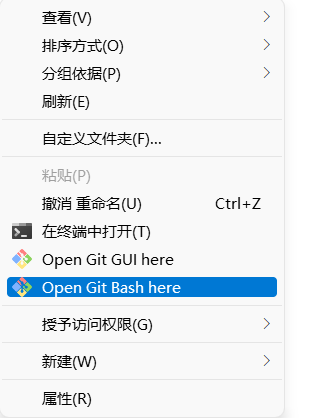

#  前言
  
  
自己搭建本地的github仓，方便进行查询、学习和分享。
  
#  1. Github的客户端安装
  
  
官方下载地址：
* [windo版本链接](https://gitforwindows.org/ )
  
#  2. Github注册账号
  
  
 [Github官网](https://github.com/ )
  
  
##  创建远端仓
  
  
记住自己创建账号的email

  
  
（1）问题：github国内登陆不上
  
由于域名的解析问题，导致存在登陆时间长, [解决方法](https://www.panziye.com/teach/4503.html )。
  
    链接中方法： 在C:\Windows\System32\drivers\etc中的hosts文件中增加三行：
  
    20.205.243.166 github.com
    140.82.113.4 github.com
    199.232.69.194 github.global.ssl.fastly.net
  
    然后cmd窗口中输入：
    ipconfig /flushdns
  
#  3. 配置本地git环境
  
  
为了能够链接远端的仓，需要配置本地git环境。通过本地的用户名和邮箱，生成SSH KEY的公钥。
  
如果没有在远端添加自己的公钥，ssh链接github的时候就会报权限不足：

  
打开本地git界面，右键选择：

  
##  step1: 设置用户名和邮箱
  
     git config --global user.email "myemail"
  
##  step2：生成本地的ssh
  
    $ ssh-keygen -t rsa -C "申请github账号的email"
  
查看生产的ssh:

  
#  4. 将本地生产的公钥添加到远端仓上
  
  
登陆github的账号，点击头像->设置->左侧SSH and GPG key->NEW SSH KEY
将本地的生产的公钥添加进去。

  
  
#  结束
  
可以本地拉取远端仓的数据或代码。
  
  
  
  
  
  
  
  
  
  
  
  
  